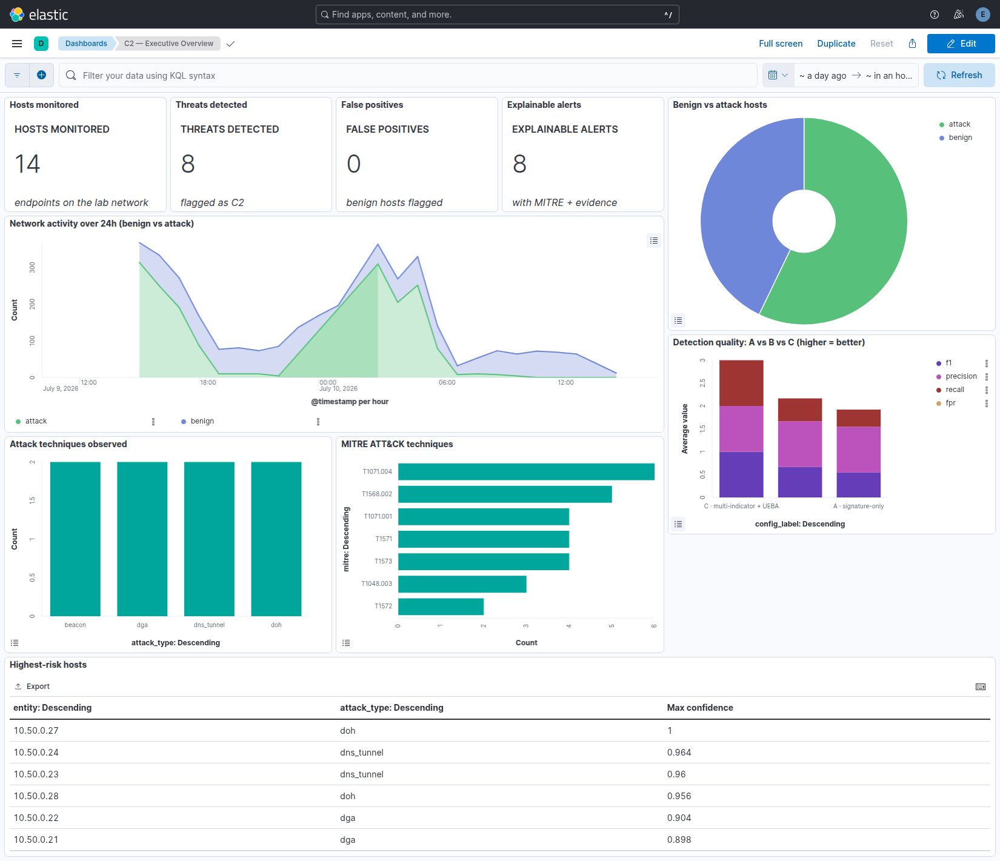
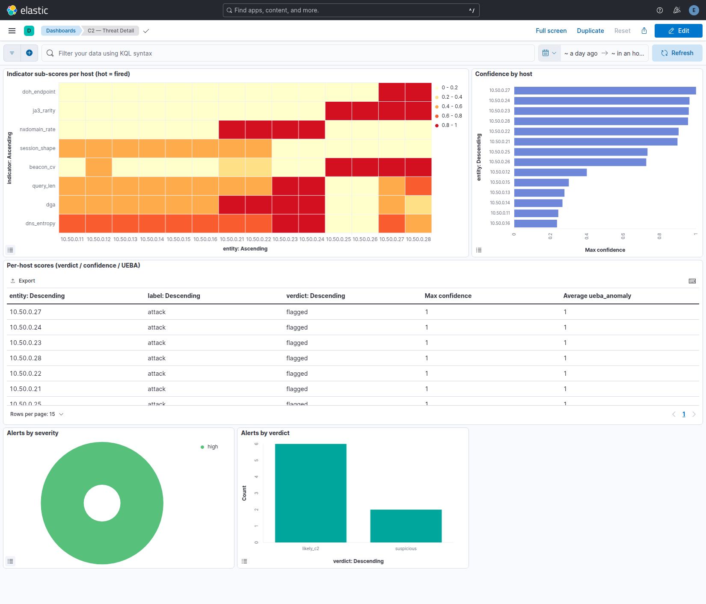
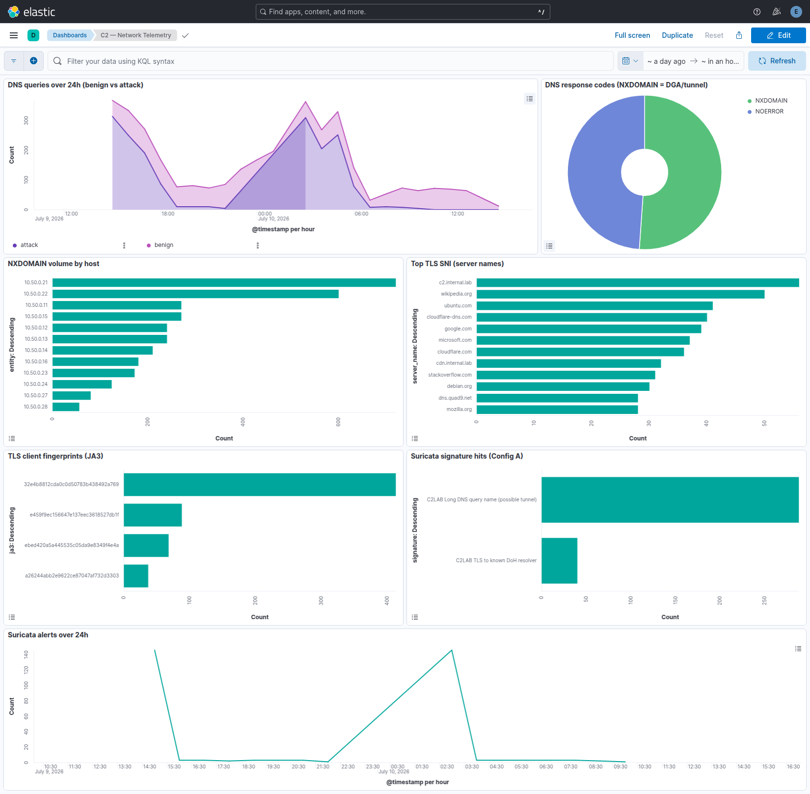

# Architecture & Data Flow — Behavioral DNS/HTTPS C2 Detection

> A visual, self-contained version of this document (with diagrams) is in
> [`docs/architecture.html`](architecture.html) — open it in a browser.

## The core problem

After malware compromises a machine it must **phone home** to its operator — to receive commands and
exfiltrate data. That channel is **command-and-control (C2)**. Attackers hide it inside traffic every
network already allows:

- **Encrypted web (HTTPS):** the payload is inside TLS, so packet contents are invisible — a firewall
  only sees "a host visited a website."
- **DNS & DNS-over-HTTPS (DoH):** DNS is required everywhere and rarely blocked; malware tunnels data
  through it, or hides it in DoH where even the resolver can't inspect it.
- **Looks legitimate:** low-and-slow beacons, domains that rotate daily (DGA), traffic shaped like a
  browser. There is **no fixed bad string** to match.

Signature/IOC matching answers "have I seen this exact bad thing before?" Against traffic that is
encrypted, ever-changing, and disguised as normal, the answer is almost always *no*. The industry
shift is from **signatures to behaviour**: not "is this a known-bad string" but *"does this host
behave like it is talking to a controller?"* One behaviour is noisy; **several weak behaviours,
correlated and baselined against normal, become a strong, defensible signal.**

## The idea

1. **Observe behaviour** — 8 indicators per host from real network telemetry.
2. **Baseline with UEBA** — how far is this host from normal? (IsolationForest + z-score)
3. **Correlate** — glass-box weighted fusion + boost rules; requires corroboration.
4. **Explain** — verdict, contributing indicators + reasons, MITRE ATT&CK, recommended actions.

## Architecture (infrastructure)

```
 Endpoints            Capture & Sensors (Analysis VM)        Detection engine            Store & Visualize
 ─────────            ──────────────────────────────         ────────────────            ─────────────────
 6 benign      ─┐     inline gateway + DNS resolver     ┌─►  8 behavioral indicators ─►  Elasticsearch
 2 DGA          │     tcpdump  (100% inline capture)    │    UEBA anomaly (IF + z)       (alerts · scores ·
 2 tunnel       ├──►  Zeek (dns/ssl/conn) + Suricata ───┤    correlation (glass-box)      telemetry)
 2 beacon       │     local C2 (beacon target :8443)    │    explainable alert       ─►  Kibana (3 dashboards)
 2 DoH         ─┘                                       └──────────────────────────►
```

Each endpoint is a **real host with its own IP and TLS fingerprint**. The analysis VM is their
gateway + DNS resolver, so all traffic passes through it and is captured **100% inline**. (No nested
virtualization on the host, so endpoints are lightweight containers rather than full VMs — but the
network path and per-host telemetry are exactly as a multi-VM lab would produce.)

## Data flow — packet to explained alert

```
Packets ─► Zeek + Suricata ─► 8 sub-scores/host ─► UEBA score ─► correlation ─► explainable alert ─► ES ─► Kibana
(tcpdump)   (telemetry)        (features)          (anomaly)     (verdict)      (MITRE + actions)
```

1. **Capture** — tcpdump records every packet on the lab bridge.
2. **Sensors** — Zeek writes structured logs (DNS queries, TLS SNI + JA3, connections); Suricata runs
   the signature baseline (Config A).
3. **Features** — the 8 indicators are computed per host as 0–1 sub-scores.
4. **UEBA** — IsolationForest + z-score scores how anomalous the host is vs. benign baseline.
5. **Correlate & explain** — weighted fusion + boost rules → confidence; over threshold → an
   explainable alert (verdict, contributing indicators, MITRE, recommended actions).
6. **Store & visualize** — Elasticsearch + three Kibana dashboards.

## The eight behaviours (indicators → MITRE)

| Indicator | What it catches | MITRE ATT&CK |
|---|---|---|
| Domain entropy | Random-looking domains → DGA / tunneling | T1568.002 |
| DGA structure | Length + digits + few vowels | T1568.002 |
| NXDOMAIN rate | Bursts of failed lookups | T1568.002 |
| Query length | Long / deep names carry data | T1071.004 |
| Beacon regularity | Low-jitter call-home timing (gap-robust median/MAD) | T1071.001, T1571 |
| JA3/JA4 rarity | TLS fingerprint unseen in baseline | T1573 |
| DoH endpoint | DNS hidden inside HTTPS | T1071.004, T1572 |
| Session shape | Small, steady, long-lived flows | T1071.001 |

**No single row is conclusive — the correlation across rows is the detector.** A benign host with
high-entropy CDN hostnames trips one indicator but never crosses the threshold because correlation
requires corroboration + a high UEBA anomaly.

## Results — behaviour + UEBA vs signatures (head-to-head)

Same real capture (14 hosts: 6 benign, 8 attack), scored three ways:

| Configuration | Precision | Recall | F1 | False-positive rate |
|---|---|---|---|---|
| A — signature-only (Suricata) | 1.00 | 0.38 | 0.55 | 0.00 |
| B — best single indicator | 1.00 | 0.50 | 0.67 | 0.00 |
| **C — multi-indicator + UEBA** | **1.00** | **1.00** | **1.00** | **0.00** |

**C detects all four techniques (DGA, tunneling, beaconing, DoH) with zero false positives.**
Signatures structurally miss DGA and beaconing; every single indicator misses at least one technique.
Only the correlation catches everything.

## The dashboards

**Executive overview** — coverage, threats, attack mix, MITRE, and the A/B/C comparison:



**Threat detail** — the indicator heatmap shows exactly which behaviours fired per host:



**Network telemetry** — DNS/NXDOMAIN over time, C2 server names, JA3 fingerprints, signature hits:



## Reproduce

```bash
source config/secrets.env
make lab-demo     # 14 hosts -> inline capture -> A/B/C -> Elasticsearch -> dashboards
```

Kibana: https://172.16.242.14:5601 (log in as `elastic`).
